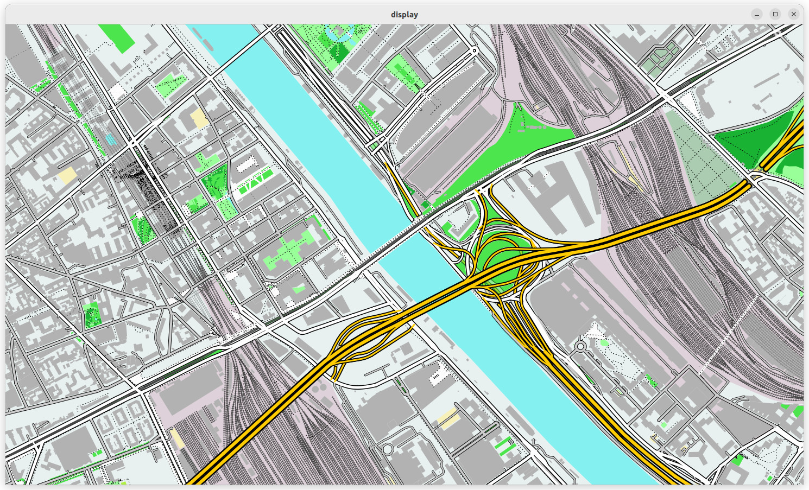

Installation
============

This software only works on 64-bit machines.
The following external libraries are needed: camlzip, cairo2-gtk.
They can be install through opam:
```
   opam install camlzip cairo2-gtk
```

To compile, just type `make`.

Usage
=====

At the moment, we provide a tool `display` that displays a map and can
be used to compute shortest paths on this map. A number of tools need
to be run first to build the data used by `display`. All these tools
should scale to the whole world, except for the routing preprocessor
which currently requires a huge amount of memory (~ 100 GB?) in this
case. The France data can be processed on a 8 GB machine.

Loading a PBF file
------------------
The `load` tool will load a PBF file into the database:

```
./load ile-de-france-latest.osm.pbf
```

PBF files can be found for instance at this address:
http://download.geofabrik.de/europe/france.html

The data is written to the `base`, `source` and `string`
subdirectories of a database (currently hardcoded to `/tmp/osm`).
(See the `database` section for more details on the structure of the
database.)

The `base` directory contains the following tables:
```
  Nodes
    node/id                    The node id in the OpenStreetMap database
    node/lat                   Node latitude
    node/lon                   Node longitude
  Node tags
    node_assoc/idx             Index of the node in the node table
    node_assoc/key             Key (string)
    node_assoc/val             Value (string)
  Ways
    way/id                     The way id in the OpenStreetMap database
  Way tags
    way_assoc/idx              Index of the way in the way table
    way_assoc/key              Key (string)
    way_assoc/val              Value (string)
  Way nodes
    way_refs/way               Index of the way in the way table
    way_refs/node              Index of the node in the node table
  Relations
    relation/id                The relation id in the OpenStreetMap database
  Relation tags
    relation_assoc/idx         Index of the relation in the relation table
    relation_assoc/key         Key (string)
    relation_assoc/val         Value (string)
  Relation members
    relation_members/relation  Index of the relation in the relation table
    relation_members/type      Type of the member (0: node, 1: way, 2:relation)
    relation_members/member    Index of the member in the appropriate table
    relation_members/role      Role of the member (string)
```
The `string` directory contains a string dictionary associating a
unique integer to each string.

Querying the database
---------------------

The tool `query` can be used to access the contents of this database:
- Without argument, it will list all columns.
- Given a subdirectory of the database, it will list the columns in
  this directory:
```
./query base
```
- Given a list of columns, it will output the contents of these columns:
```
./query base/node/{id,lat,lon}
```
- The `--string` option tells the tool to resolve and output the
  strings contained in the subsequent columns, using the string
  dictionary:
```
./query base/node_assoc/idx --string base/node_assoc/{key,val}
```
(The `--num` option swithes back to outputing integers.)
- The `--index i` option can be used to read this one line of table.
  For instance, this returns the OSM id of the node at index 1234:
```
./query base/node/id --index 1234
```

Preprocessing
-------------

The five following operations need to be performed before being able
to display the map:
- extract multipolygons:                               `./multipolygons`
- build surface R-trees:                               `./surfaces`
- build R-trees of linear features:                    `./linear`
- build the routing graph:                             `./highway`
- preprocess the routing graph:                        `./contraction`
  (we use so-called contraction hierarchies to speed-up route
  searches)

Optionally, you can include the coastline data:
- download coastlines-split-4326.zip from
  https://osmdata.openstreetmap.de/data/coastlines.html
  (shapefile format, containing linestrings in WGS84 projection)
- build the coastline R-trees:
```
./coastline /path/to/coastlines-split-4326.zip
```

Map display
-----------

The command `display` displays the map. One can pan the map with the
mouse and zoom using the mouse wheel. The start and destination of a
route can be set by clicking respectively with the left and right
mouse button.

Database
========

We make heavy use of a specialized database engine for data storage
and processing.

Currently, the database path is hardcoded as `/tmp/osm`

Data is stored using three possible formats:
- columns of 63-bit integers
- string dictionaries
- R-trees

Columns
-------
Columns contain 63-bit integers.

Columns are compressed by performing a delta encoding and using a
variable-length encoding. This considerably reduces the disk memory
usage and speeds up I/Os.

A number of operations are implemented to process columns in an
efficient manner: one can read sequentially the contents of a column,
sort two columns according to the first column, perform a join between
two pairs of columns, ...

Random access is possible, but should be avoided when possible, as it
is slow.

String dictionaries
-------------------
A string dictionnary associates a unique positive integer to each
string. Strings can thus be compared by their id, without lookup.
A two-way mapping between strings and their identifier is provided.

At the moment, we use a single dictionnary, stored in the `strings`
directory.

R-tree
------

An R-tree is a kind of extension of B-trees to multidimensional
objects. Each node in the tree holds the bounding box of its children.
Hence, given a rectangle, one can efficiently find all leaves whose
bounding box intersects with the rectangle.

R-trees are stored as a directories containing files `0`, `1`, ..., `n`.
Files `1` to `n` contain nodes and are managed by the database. The
contents of the leaf file `0` is free: when performing a request, we
will get a list of leaf pages and it is our job to decode these pages.
Page overflows (chunk of data that spans several pages) are possible,
by reporting an empty bounding boxe for overflow pages.

In order to build a R-tree, we sort the data according to there
position on the Hilbert curve (which ensure good locality properties)
and then insert them sequentially in the R-tree.
(http://en.wikipedia.org/wiki/Hilbert_R-tree)
